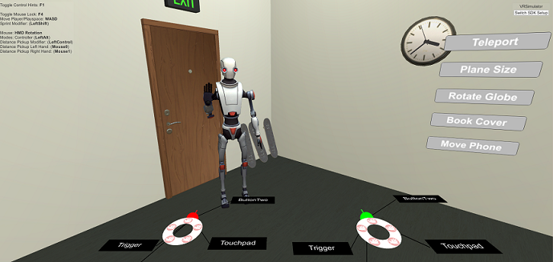
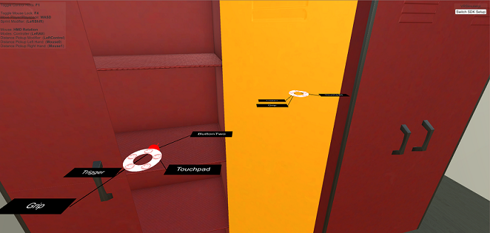
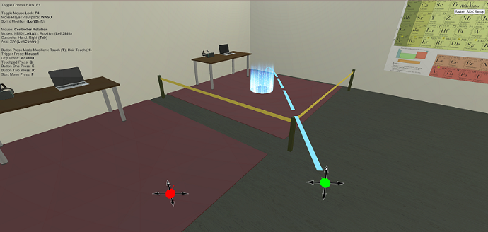

# Virtual Reality - Special Topics (CAP5937) at UCF
   Spring 2020 course taught by Dr. Ryan P. McMahan about topics in virtual reality and VR environment development using Unity. This repository is created by Mykola Maslych for managing the project files for the assignment submissions.

### Running project files
   1. Install [Unity Hub](https://unity3d.com/get-unity/download) and through it [Unity 2019.2.17](unityhub://2019.2.17f1/8e603399ca02)
   2. Clone the repository `git clone https://github.com/maslychm/VR_CAP5937.git`
   3. Using Unity Editor, navigate to `Assets/Scenes/Homework *.unity`

### Submissions
Submissions were done through submitting the project files and a video demonstration of implemented scenes. Each assignment has a separate scene, and below are links to YouTube videos.

### Assignments
   * Assignment 1 - Design and implement high-fidelity virtual environments
   * [Assignment 2](https://youtu.be/ubOBumoRzcM) - Implement usable travel techniques
   * [Assignment 3](https://youtu.be/cmeJvvqDyWY) - Implement usable manipulation technique
   * [Assignment 4](https://youtu.be/8rPFymn2xyc) - Design and implement functional menu interfaces
   * [Assignment 5](https://youtu.be/-GycsgQl49U) - Design and implement physics-based interactions
   * [Assignment 6](https://youtu.be/qNLsk34TDfg) - Design and implement animation-based interactions

### Screenshots
   
   
   

### Acknowledgements
   All of the files used in this project were distrubuted for free at the time of the project creation. Most were taken from the [Unity Store](https://assetstore.unity.com/) and some on [Sketchfab](https://sketchfab.com/).